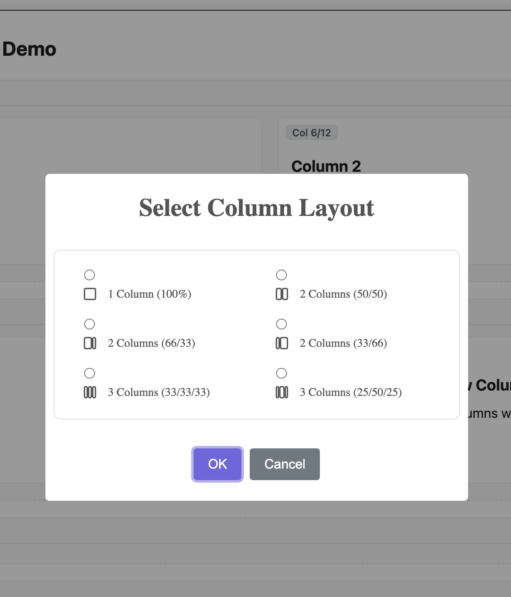
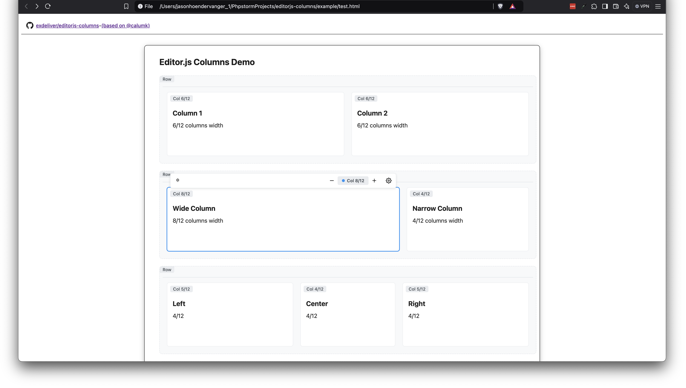

# @exdeliver/editorjs-columns

A **BETA** plugin based on the work of **@calumk** that allows users to create columns in Editor.js.

> Pull requests welcomed!

## Installation

> npm i exdeliver/editorjs-columns

> https://cdn.jsdelivr.net/npm/@exdeliver/editorjs-columns@latest

## Demo




## Features

* [x] Support new vertical menu style
* [x] Save/Load
* [x] Support for 1/12 columns
* [x] Support for padding
  * [x] Migrate storage to array
  * [x] Add tool to change type
  * [x] Added tool to switch/roll arrays
* [ ] Refactor code for legibility
* [ ] Tests

## ChangeLog

> 28/04/23 - Re-added feature - EditorJs must now be passed as an instance through the tool to the child, to avoid duplicate Editor.js installs, and ensure only one Editor.js instance is used.
> 16/05/22 - Removed global tool variable. Switched to config variable for column tools (see Example).
> ~~22/05/22 - EditorJs must now be passed as an instance through the tool to the child, to avoid duplicate Editor.js installs~~ - Rolled Back.

# Known Bugs
* Pressing the enter key inside a column will exit the column.
  * Can be solved (sort-of) by using @calumk/editorjs-paragraph-linebreakable.
* Pressing the tab key inside the column will launch both column and parent tools.
* Copy/Pasting can cause duplication of data in the wrong place.
* ~~Z-index issues with toolboxes~~.
* ~~Tools are hosted as global variables~~.
* ~~All styling is currently only in the example.html~~.
  * ~~Column styling should move to the plugin~~.
  * ~~Opinionated styling (Borders, rounded corners, hover shadow) will remain in example.html~~.
* ~~SVG logo is not rendering correctly in the new vertical menu~~.

## Docs
None yet, see example/example.html for usage.

---

> Note: Tools are passed to editorjs-columns using the config.tools property.

```javascript
// First define the tools to be made available in the columns
let column_tools = {
    header: Header,
    alert: Alert,
    paragraph: editorjsParagraphLinebreakable,
    delimiter: Delimiter
}

// Next define the tools in the main block
// Warning - Don't just use main_tools - you will probably generate a circular reference 
let main_tools = {
    // Load Official Tools
    header: Header,
    alert: Alert,
    paragraph: editorjsParagraphLinebreakable,
    delimiter: Delimiter,

    columns: {
        class: editorjsColumns,
        config: {
            EditorJsLibrary: EditorJs, // Pass the library instance to the columns instance.
            tools: column_tools // IMPORTANT! Reference the column_tools
        }
    },
}

editor = new EditorJS({
    tools: main_tools,
});